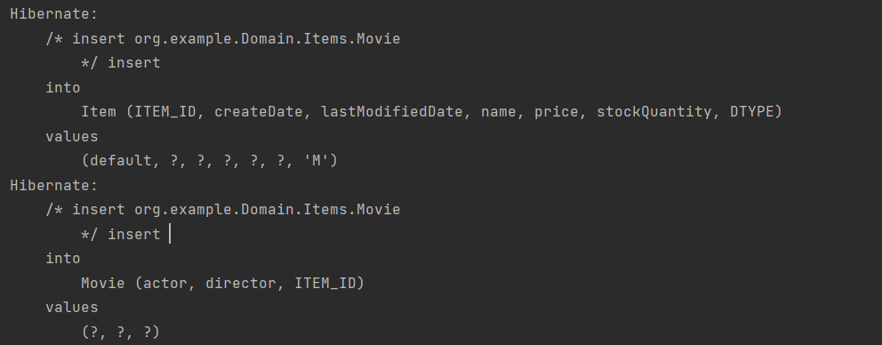
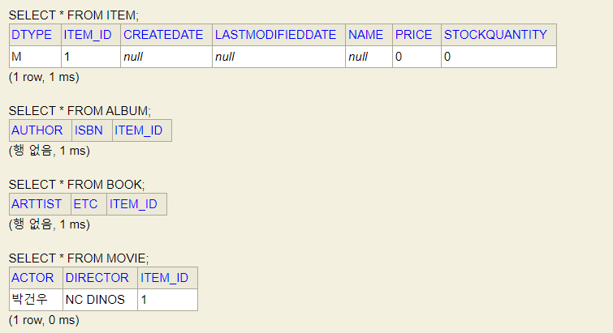
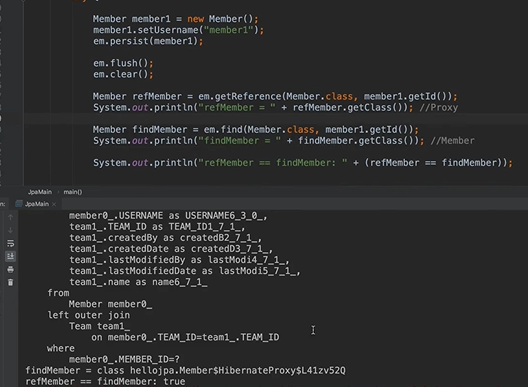
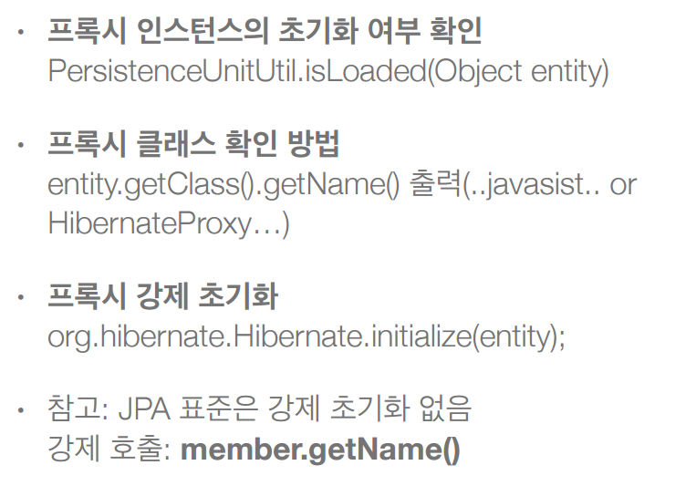
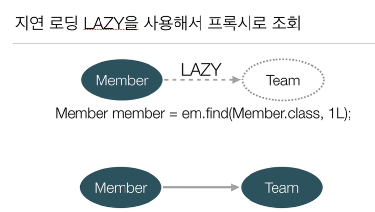

## 자바 ORM 표준 JPA 프로그래밍 - 기본편

### 1. Entity 설계와 매핑, Table 생성

-------

### 2. 연관관계 매핑

-------

### 3. 배송, 카테고리 엔티티, 테이블 추가 

-------

### 4. 고급 매핑 (상속관계 매핑, MappedSuperClass)

    * 상속관계 매핑 추가: @Inheritance(strategy = InheritanceType.JOINED) or SINGLE_TABLE or TABLE_PER_CLASS

    * MappedSuperClass: 부모클래스를 상속 받는 자식 클래스에게 매핑 정보만 제공하고 싶을 때 사용
                        
                        @MappedSuperClass는 실제 테이블과 매핑되지 않고, 단순히 매핑 정보를 상속할 목적으로만 사용된다.

- > 조인 전략을 사용해서 Item 엔티티를 상속 받은 Movie 엔티티에 데이터 추가 

@Inheritance(strategy=InheritanceType.JOINED), 
@DiscriminatorColum(name = "DTYPE"), 
@MappedSuperclass 어노테이션 사용

---------
### 5. 프록시와 연관관계

##### 프록시

-> 이때 출력값을 보면 'class hellojpa.Member'로 같은 값이 나온다. 

1. 이유는 이미 1차캐시에 올라가 있으므로 굳이 프록시를 사용하여 사용할 때 조회되는게 아니라 있는 값을 그대로 사용하기 때문에 같은 값이 출력된다. (원본반환) 
2. 이미 영속성 켄텍스트에 있으면 프록시가 아니라 실제 엔티티를 반환한다. (JPA는 '==' 비교 시 true를 보장해줘야한다.)

-> 이것도 true로 출력 값이 나온다.
refMember : 프록시로 반환됨.
findMember : 프록시로 반환됨.

1. 이유 : em.getReference()에서 한 번 프록시를 반환하면 em.find()에서도 프록시를 반환한다. -> true를 보장해주기 위해서

프록시이던 아니던 개발 할 때 문제를 만들지 않는게 중요!

영속석 컨텍스트에 원하는 엔티티가 이미 있는데 데이터베이스를 굳이 또 조회할 필요가 없다. 

* 영속성 컨텍스트를 종료 했을 때, 즉 준영속 상태에서 프록시 초기화를 시도 했을 때 실제 엔티티를 조회 할 수 없으므로 예외가 발생한다. 

* 프록시 초기화 확인

-------------

##### 지연로딩을 사용한 프록시 조회

