## 자바 ORM 표준 JPA 프로그래밍 - 기본편

#### 1. Entity 설계와 매핑, Table 생성

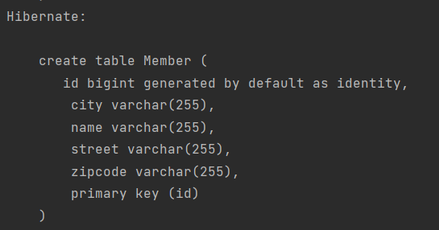

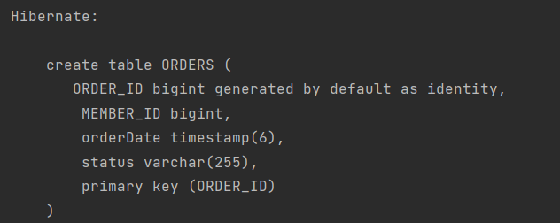

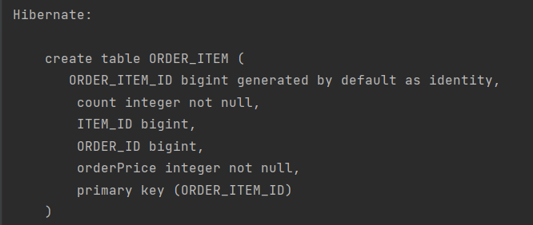

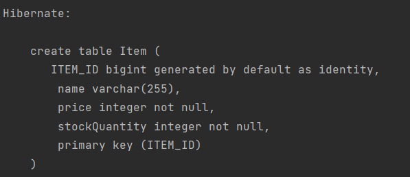

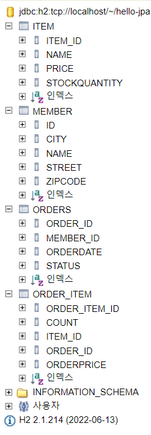

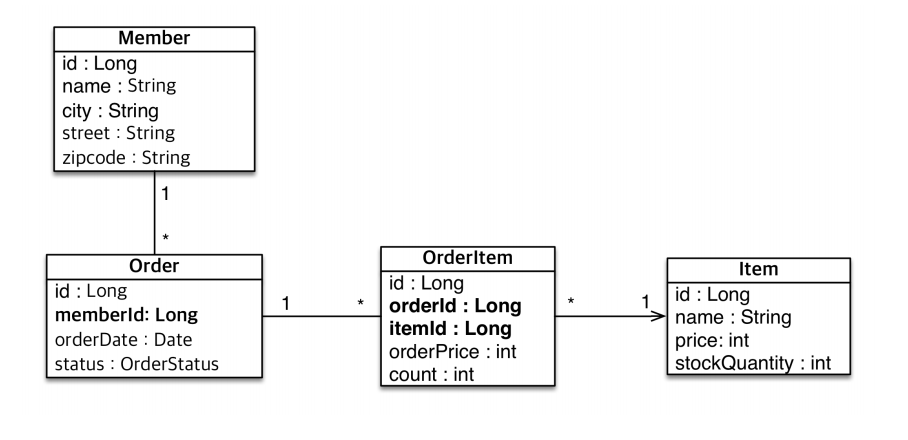

#### 2. 연관관계 매핑

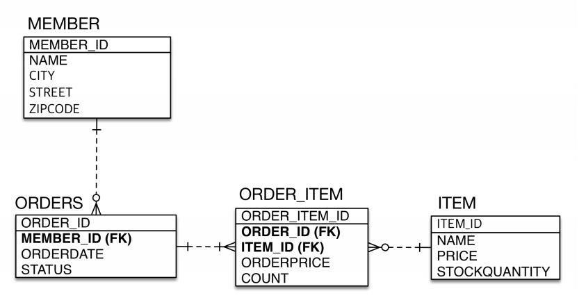

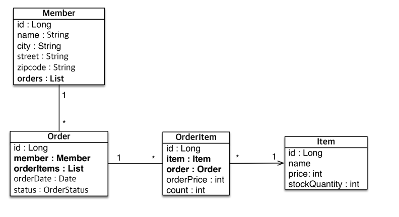

#### 3. 배송, 카테고리 엔티티, 테이블 추가 

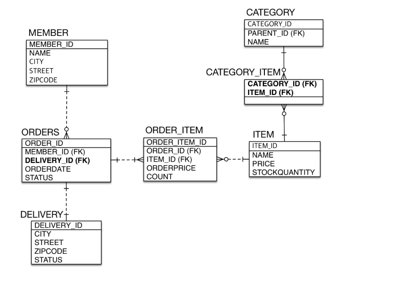

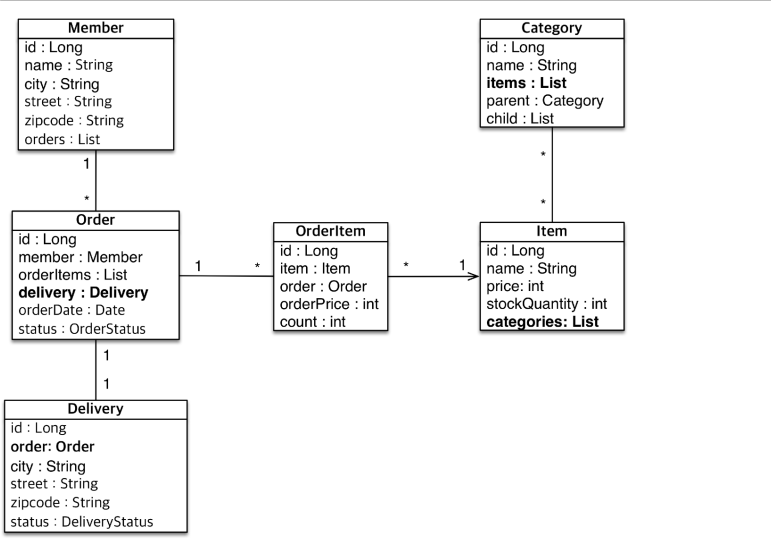

#### 4. 고급 매핑 (상속관계 매핑, MappedSuperClass)

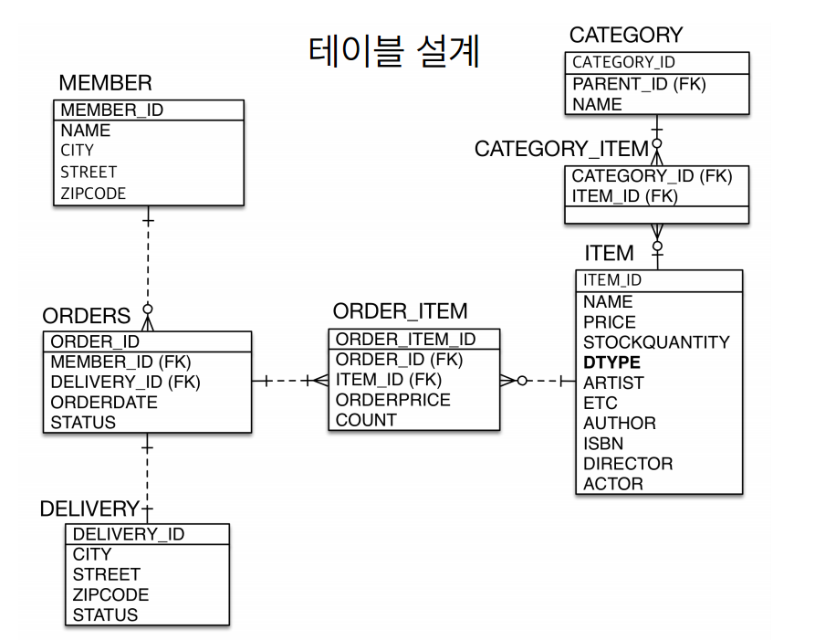

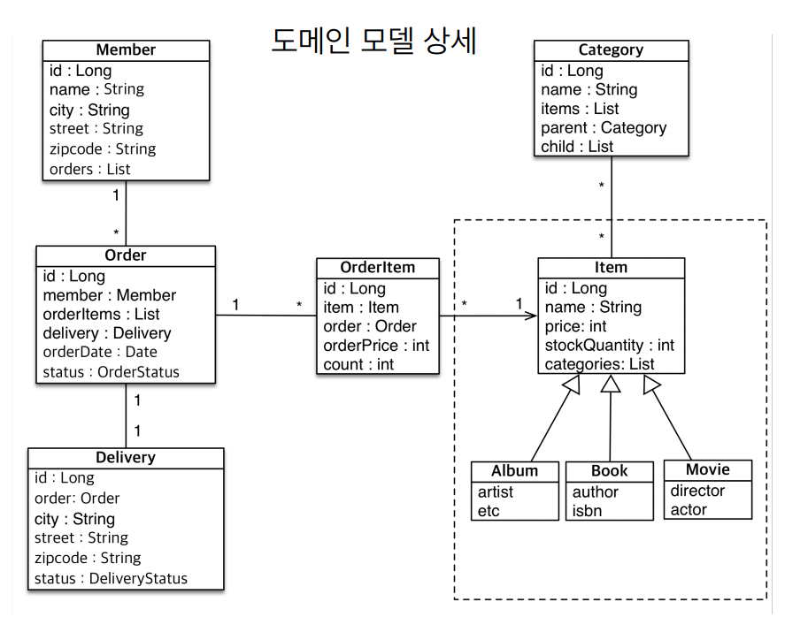

    * 상속관계 매핑 추가: @Inheritance(strategy = InheritanceType.JOINED) or SINGLE_TABLE or TABLE_PER_CLASS

    * MappedSuperClass: 부모클래스를 상속 받는 자식 클래스에게 매핑 정보만 제공하고 싶을 때 사용
                        
                        @MappedSuperClass는 실제 테이블과 매핑되지 않고, 단순히 매핑 정보를 상속할 목적으로만 사용된다.