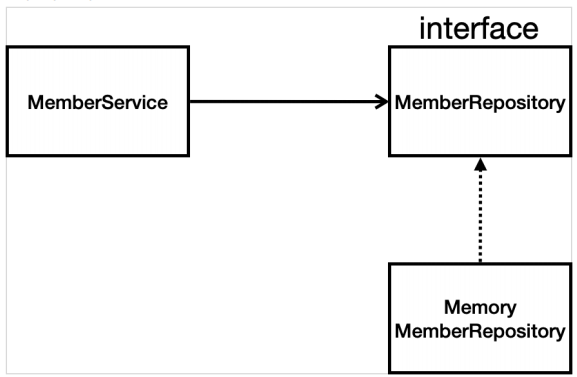

## Spring 입문

### 1. Controllor

#### 1 ) thymeleaf 템플릿 엔진 동작 확인 

* localhost:8080/hello 접속 (@GetMapping("hello"))
* HelloController 에서 리턴 값("hello")과 model 객체를 받는다. 
* 리턴 값에 따라 hello.html의 ${data} 에 "hello!!"를 넣어준다.
* viewResolver가 컨트롤러에서 리턴 값을 받아 문자로 반환하여 hello.html를 완성한 후 웹 브라우저에 전달한다.  

#### 2) 정적 컨텐츠

* localhost:8080/hello-static.html 접속 -> 컨트롤러와 viewResolver를 거치지 않고 바로 웹 브라우저에 화면을 전달한다. 

#### 3) MVC와 템플릿 엔진

* @RequestParam("가져올 데이터명") 데이터타입 데이터변수 -> 'localhost:8080/hello-mvc?name=입력값' 접속
* 데이터변수인 name 에 아무 값을 넣지 않은채로 접속하면 오류가 난다. 

#### 4) @ResponseBody 사용 (viewResolver 사용x)

* HTTP의 BODY에 문자 내용을 직접 반환 
* 'localhost:8080/hello-api' 접속 
* viewResolver 대신 HttpMessageConverter가 동작된다.
* @ResponseBody를 사용하고 객체를 반환하면 객체가 json 형태로 변환된다. 

--------

### 2. 회원 관리 예제 - 백엔드 개발

#### 비지니스 요구사항
    * 데이터 : 회원ID, 이름
    * 기능: 회원 등록, 조희
    * 데이터 저정소: 시작은 메모리
    * Controller: 웹MVC의 컨트롤러 역할
    * Service: 핵심 비지니스 로직 구현
    * Repository: 데이터베이스에 접근, 도메인 객체를 데이터베이스에 저장하고 관리
    * Domain: 비지니스 도메인 객체

클래스 의존 관계

#### 회원 도메인과 리포지토리 만들기 
* 회원 객체 -> Member
* 회원 리포지토리 인터페이스 -> MemberRepository
* 회원 리포지토리 메모리 구현체 -> MemoryMemberRepository

#### 회원 리포지토리 테스트 케이스 작성
* 회원 리포지토리 메모리 구현체 테스트 -> MemoryMemberRepositoryTest

#### 회원 서비스 개발
-> MemberService

-> 기존: 회원 서비스가 메모리 회원 리포지토리를 직접 생성

`private final MemberRepository memberRepository = new MemoryMemberRepository();`

-> 변경: DI 가능하게 바꿈

`private final MemberRepository memberRepository;`

`public MemberService(MemberRepository memberRepository) {this.memberRepository = memberRepository;}`

#### 회원 서비스 테스트
-> MemberServiceTest

-------------
### 3. 스프링 빈과 의존 관계 
1) 컴포넌트 스캔과 자동 의존관계 설정
2) 자바 코드로 직접 스프링 빈 등록하기 (이 방법을 사용)
##
#### 컴포넌트 스캔과 자동 의존관계 설정
회원 컨트롤러가 회원 서비스, 회원 리포지토리를 사용할 수 있게 의존관계를 설정한다. 

먼저 회원 컨트롤러에 @Controller, @Autowired 를 사용한다. 

생성자에 @Autowired 가 있으면 스프링이 연관된 객체를 스프링 컨테이너에서 찾아서 넣어 준다. 

이렇게 객체 의존관계를 외부에서 넣어주는 것을 DI(Dependency Injection) 이라고 한다. (의존성 주입)

이 상태에서 실행하면 memberService, memberRepository 가 스프링 빈에 등록되어 있지 않기 때문에 오류가 발생한다. 

`Consider defining a bean of type 'hello.hellospring.service.MemberService' in
your configuration.`

회원 서비스와 회원 레포지토리에 @Component를 포함하는 어노테이션을 추가하면 스프링 빈으로 자동 등록된다.
추가로 생성자에도 DI를 위해 @Autowired 어노테이션을 추가해야 한다. 

#
#### 자바 코드로 직접 스프링 빈 등록하기 
우선 이전에 등록한 @Service, @Repository, @Autowired 어노테이션을 제거하고 진행한다. 

hello.hello-spring2 아래 SpringConfig 파일을 생성한다. 

@Configuration 어노테이션을 추가한다. 

`@Bean
public MemberService memberService() { 
return new MemberService(memberRepository());
}

@Bean
public MemberRepository memberRepository() {
return new MemoryMemberRepository();
} `

위와 같이 코드를 작성하면 스프링 빈으로 등록된다. 

이 방법을 사용하면 나중에 메모리 레포지토리를 다른 레포지토리로 변경할 때 코드 한 줄만 수정해주면 된다. 

* DI에는 필드 주입, setter 주입, 생성자 주입이 있다. 의존관계가 실행중에 동적으로 변하는 경우는 거의 없기 때문에 생성자 주입을 권장한다.
* 지금은 저장소를 확정한 상태가 아니기 때문에 레포지토리를 바꿔가면서 실행하지만 실무에서는 저장소를 하나 정해놓고 진행하기 때문에 컴포넌트 스캔을 사용한다. 

------

### 4. 회원 관리 예제 - 웹 MVC 개발

